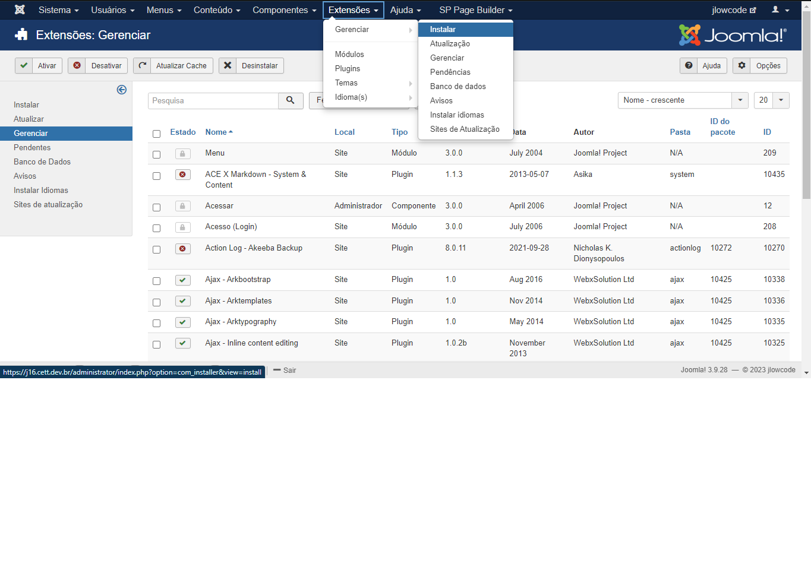

# Popula Lista

## Instalação

Primeiramente, deve-se instalar o plugin popula_list. Para isso, em sua tela de administrador do Joomla vá em Extensions->Manage->Install e clique na aba Upload Package File como na imagem abaixo.

 

Após isso, basta navegar aos arquivos .zip da extensão necessária e arrastar para a caixa de seleção, se ocorrer tudo como esperado na instalação o resultado deve ser o seguinte.

## Configurações Iniciais

Após a instalação é preciso realizar algumas etapas de configurações simples para o funcionamento do Plugin.

**1. Verificar se a extensão instalada está habilitada**

Para isso vá em Extensions->Manage->Manage e na aba de pesquisa digite "popula" e clique enter, como na imagem abaixo. Ao aparecer o componente instalado anteriormente verifique na coluna "Status" se está habilitado, se não estiver clique em cima do ícone para habilitá-lo.

**2. Importar modelos de listas e formulários**

Agora, com o plugin instalado vai até, a lista que deseja Inserir os dados Aleatorios. Vá Até a aba Plugin

Clique em adicionar. 

=> Opção publicado dve estar marcado como "SIM" 

=> Opção -- Ir --*  voce procura pelo plugin popula_list 

=> Opção Description, pode colocar algo a sua escolha. 

=> Agora, o ultima Campo voce precisa Selecionar a quantidade de Dados que Deseja Inserir no Banco de Dados 

**3. Informações Importantes**

Este Plugin é Capaz de gerar Muitos Dados, tome cuidado pois não existe limitação de dados.

Com o Plugin Ativado, ele Irá Gerar os Dados sempre que o Administrador Acessar a Pagina Da Lista, e uma Mensagem Será Mostrada na tela como Alerta

**4. o Plugin Vem pré configurado com algumas Colunas no banco de dados para ser mais realista:**

Nome

Sobrenome

Cidade

Telefone

Empresa

Se Escolher Estas Colunas os Dados serão gerados, de acordo. Caso sua lista tenha outras colunas, os dados serão gerados em sequencia utilizando o nome da coluna.

